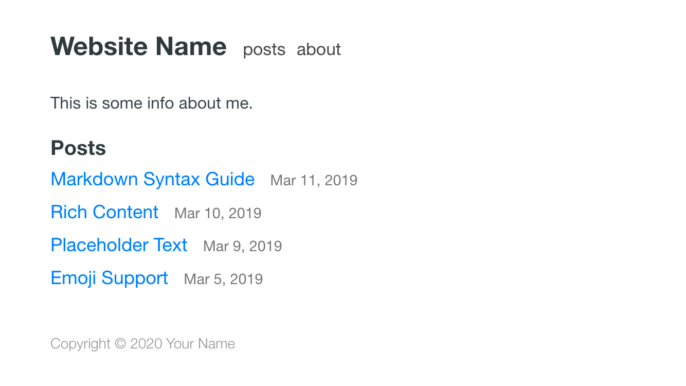

# HugoPost

HugoPost is a lightweight, responsive theme for [Hugo](https://gohugo.io), designed for clean personal publishing and fast static-site deployment.



## Features

* Homepage with a list of posts.
* Support for standalone pages.
* Responsive layout for mobile and desktop.
* Syntax highlighting with customizable styles.
* Dark theme that follows the user's system preference.
* No external JavaScript dependencies, no web fonts.
* Internationalization friendly.

## Installation

Add the theme to your Hugo site's `themes` folder:

```bash
git submodule add https://github.com/haenlau/HugoPost.git themes/HugoPost
```

Run the site with the theme enabled:

```bash
hugo server -t HugoPost
```

## EdgeOne Pages

For Tencent Cloud EdgeOne Pages, use:

```text
Build command: hugo --gc --minify
Output directory: public
```

This repository can be deployed directly as a Hugo static site. The sample theme configuration is also available in `exampleSite/`.

If you only want to build the sample site, use:

```text
Build command: hugo --source exampleSite --themesDir .. --theme HugoPost --destination public --gc --minify
Output directory: exampleSite/public
```
