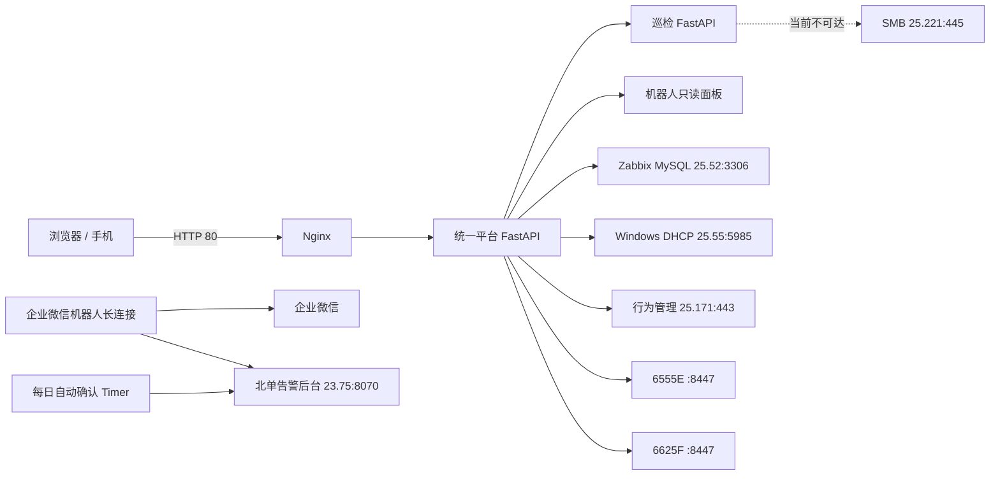

+++
author = "haenlau"
title = "值班辅助平台的部署、迁移与恢复"
url = "/fangyu-platform-deployment/"
date = "2026-08-17T01:56:52+00:00"
description = "记录一个值班辅助平台的部署与维护，包含统一入口、外部系统接入、数据备份和恢复。"
tags = [
  "记录",
]
+++

## 1. 文档目标与边界

这是一个给值班人员使用的业务辅助平台。它把日常巡检、告警处理、办公网查询、设备操作和企业微信机器人放到同一个入口里，减少重复操作。下面记录它的部署、迁移、恢复和验收方法。

- 统一登录、用户管理、审计日志和工作台前端；
- 每日值班巡检、图片处理和 Word 报告；
- Zabbix 大屏告警查询与清除；
- 办公网 IP 主机名查询；
- 行为管理设备上的恶意域名封禁与解封；
- 两台华为防火墙上的恶意 IPv4 封禁与解封；
- 企业微信告警确认机器人、只读状态面板和每日自动确认任务；
- Nginx、systemd、双网卡路由、SQLite 数据、报告目录、备份和回滚。

以下系统是平台的外部依赖，本文只说明接入条件，不负责重新安装这些设备或系统本身：

- Zabbix MySQL 数据库 `<zabbix-db-host>:3306`；
- Windows DHCP Server `<dhcp-host>:5985`；
- 行为管理设备 `<behavior-device>:443`；
- 华为 6555E 防火墙 `<firewall-a>:8447`；
- 华为 6625F 防火墙 `<firewall-b>:8447`；
- 北单告警后台 `<alarm-backend>:8070`；
- SMB 文件服务器 `<smb-server>:445`；
- 企业微信智能机器人平台。

本文不保存任何真实密码。所有密码、Token、Bot Secret 都应从内部密码库或原服务器的 root 专用环境文件中取得。

## 2. 现网总体架构



关键设计：

- 浏览器只访问 80 端口，不直接访问内部业务端口；
- 平台主服务负责统一鉴权、菜单、首页状态、审计和业务 API；
- 巡检业务数据库保持独立，不合并进平台数据库；
- 机器人业务保持独立，由平台只读聚合状态；
- Zabbix、DHCP、行为管理和防火墙均由平台后端直接调用；
- 业务端口只监听 `<internal-endpoint>`，避免绕开统一登录。

## 3. 组件与端口

| 组件 | systemd 服务 | 监听地址 | 用户入口 | 数据位置 |
| --- | --- | --- | --- | --- |
| Nginx | `nginx.service` | `<internal-endpoint>` | `<internal-entry>` | `/etc/nginx/` |
| 预览入口 | Nginx | `<internal-endpoint>` | 可选预览 | `/etc/nginx/conf.d/fangyu-jingyao-preview.conf` |
| 平台主服务 | `fangyu-jingyao-platform.service` | `<internal-endpoint>` | 由 Nginx 代理 | `/var/lib/platform/` |
| 巡检服务 | `fangyu-jingyao-inspection.service` | `<internal-endpoint>` | 由平台同源代理 | `/var/lib/inspection/` |
| 机器人长连接 | `wecom-alarm-bot.service` | 无入站端口 | 企业微信命令 | `/var/lib/wecom-alarm-bot/` |
| 机器人状态面板 | `wecom-alarm-dashboard.service` | `<internal-endpoint>` | 平台机器人页面 | `/var/lib/wecom-alarm-bot/audit.db` |
| 自动确认任务 | `wecom-alarm-test-ack.timer` | 无 | 每日定时 | 同上 |

旧的独立 `8080`、`8090` Web 入口以及旧巡检服务不再是正式架构的一部分。现网的 `zabbix-alert-web.service` 和 `inspection.service` 已停用或禁用。

## 4. 当前菜单与模块顺序

平台模块由 `backend/db.py` 的 `module_registry` 统一注册，当前顺序为：

1. 工作台首页；
2. 每日值班巡检；
3. 办公网主机名查询；
4. 办公网封禁恶意地址；
5. 办公网封禁恶意域名；
6. Zabbix 大屏告警清除；
7. 北单系统大屏告警确认；
8. 我的账号；
9. 用户管理；
10. 审计日志。

“用户管理”和“审计日志”仅 `superadmin` 可见。

## 5. 主机基础要求

### 5.1 推荐规格

- Ubuntu 24.04 或更新的 LTS；现网为 Ubuntu 26.04 LTS；
- 2 核 CPU、4 GB 内存、40 GB 以上磁盘；
- 两块网卡；
- Python 3.12 以上；现网为 Python 3.14；
- 能访问内部 APT/PyPI/NPM 源，或提前准备离线依赖；
- 服务器地址固定或由 DHCP 保留为 `<platform-host>`。

### 5.2 系统软件

```bash
apt update
apt install -y \
  nginx python3 python3-venv python3-pip \
  rsync curl ca-certificates sqlite3 openssl tar
```

如果 Python 包没有可用二进制轮子，再补装：

```bash
apt install -y build-essential python3-dev libffi-dev
```

## 6. 双网卡和路由

现网：

- 主网卡 `ens7`：`<platform-host>/24`，默认网关 `<main-gateway>`；
- 第二网卡 `ens16`：`<device-source-ip>/24`，不配置默认网关；
- 行为管理 `<behavior-device>` 必须经 `ens7` 和 `<main-gateway>`；
- 6555E `<firewall-a>` 必须经 `ens16` 和 `<device-gateway>`；
- 6625F `<firewall-b>` 使用主网卡路径；
- DHCP `<dhcp-host>` 和 SMB `<smb-server>` 使用第二网卡直连路径。

接口名和 MAC 地址以新主机实际情况为准。当前 netplan 的核心结构如下：

```yaml
network:
  version: 2
  ethernets:
    ens7:
      dhcp4: true
      dhcp6: true
      routes:
        - to: <behavior-device>/32
          via: <main-gateway>
    ens16:
      dhcp4: false
      dhcp6: false
      addresses:
        - <device-source-ip>/24
      routes:
        - to: <firewall-a>/32
          via: <device-gateway>
```

如果 DHCP 没有自动下发 DNS `<internal-dns>` 的主网卡主机路由，而该 DNS 不能通过 `ens16` 访问，可在 `ens7.routes` 中增加：

```yaml
        - to: <internal-dns>/32
          via: <main-gateway>
```

远程修改 netplan 有断开 SSH 的风险，应先备份并确保有控制台或快照：

```bash
cp -a /etc/netplan/00-installer-config.yaml \
  /etc/netplan/00-installer-config.yaml.before-fangyu
netplan generate
netplan try
netplan apply
```

路由验收：

```bash
ip route get <behavior-device>
# 期望：via <main-gateway>，src <platform-host>

ip route get <firewall-a>
# 期望：via <device-gateway>，src <device-source-ip>

ip route get <firewall-b>
# 期望：主网卡路径，src <platform-host>

ip route get <dhcp-host>
# 期望：第二网卡路径，src <device-source-ip>
```

## 7. DNS 与时间

IP 主机名查询首先执行 PTR 解析，因此服务器必须使用能够解析办公网 PTR 的 DNS。现网 DNS 为 `<internal-dns>`，同时保留 `<internal-endpoint>` 作为外部备用。

```bash
resolvectl status
getent hosts <device-gateway>
```

现网操作系统时区为 UTC，但业务服务通过以下方式使用北京时间：

- 平台和巡检 systemd 单元设置 `TZ=Asia/Shanghai`；
- 机器人环境设置 `AUTO_TEST_ACK_TIMEZONE=Asia/Shanghai`；
- 定时器的 `OnCalendar` 明确带 `Asia/Shanghai`。

因此系统保持 UTC 也可以。排查日志时要注意：`journalctl` 的显示时间跟随系统时区，页面审计时间使用北京时间。

## 8. 部署前网络检查

```bash
for target in \
  '<zabbix-db-host> 3306' \
  '<dhcp-host> 5985' \
  '<behavior-device> 443' \
  '<firewall-b> 8447' \
  '<firewall-a> 8447' \
  '<alarm-backend> 8070' \
  '<smb-server> 445'
do
  set -- $target
  printf '%s:%s ' "$1" "$2"
  timeout 3 bash -c "</dev/tcp/$1/$2" 2>/dev/null \
    && echo reachable || echo unavailable
done
```

截至 2026-08-12，除 SMB `<smb-server>:445` 外，其余依赖均可达。SMB 不可达不影响本地报告生成和下载。

## 9. 平台发布包构建

### 9.1 Windows 构建机依赖

- Python 3.12 以上；
- Node.js 20 以上；
- npm 或 pnpm；
- PowerShell；
- `tar`。

### 9.2 构建和检查

在项目目录执行：

```powershell
Set-Location '<project-dir>'

Push-Location frontend
npm ci
npm run test:registry
npm run build
Pop-Location

python -m compileall -q backend integrations\inspection-backend\app
python -m unittest tests.test_firewall_mirror tests.test_platform_api

.\deploy\build-release.ps1
```

发布包输出在 `release/`，包含：

- `backend/`；
- `frontend/dist/`；
- `integrations/inspection-backend/`；
- `deploy/`；
- `docs/`；
- 报告金标准文件；
- `VERSION` 和 `CHANGELOG.md`。

发布包不会包含密码、运行数据库、报告、临时图片或 `node_modules`。

## 10. 平台与巡检服务安装

### 10.1 上传并解压

```bash
scp release/fangyu-jingyao-platform-v<版本>-<时间>.tar.gz \
  root@<platform-host>:/srv/
```

服务器上执行：

```bash
release=/srv/platform-release
mkdir -p "$release"
tar -xzf /srv/platform-v<版本>-<时间>.tar.gz \
  -C "$release"
```

### 10.2 首次启动前准备环境文件

首次安装时应在平台第一次启动前填写 `SUPERADMIN_PASSWORD`，避免自动生成随机密码。

```bash
install -m 0600 \
  "$release/deploy/platform.env.example" \
  /etc/platform.env

install -m 0600 \
  "$release/deploy/inspection.env.example" \
  /etc/inspection.env

editor /etc/platform.env
editor /etc/inspection.env
```

如果环境文件已经存在，不要用示例文件覆盖。

### 10.3 平台环境变量

`/etc/platform.env` 推荐内容如下。尖括号内容必须替换，密码保持原文，不能额外加 MD5：

```dotenv
PLATFORM_DATA_DIR=/var/lib/platform
PLATFORM_DB_PATH=/var/lib/platform/platform.db
PLATFORM_STATIC_DIR=/opt/platform/frontend/dist

INSPECTION_BASE_URL=http://<internal-endpoint>
ROBOT_BASE_URL=http://<internal-endpoint>

PLATFORM_SESSION_COOKIE=fangyu_session
PLATFORM_SESSION_ROLLING_DAYS=400
PLATFORM_SESSION_SECURE=0
SUPERADMIN_PASSWORD=<首次安装的超级管理员密码>

ZABBIX_DB_HOST=<zabbix-db-host>
ZABBIX_DB_PORT=3306
ZABBIX_DB_NAME=zabbix
ZABBIX_DB_USER=<Zabbix数据库账号>
ZABBIX_DB_PASSWORD=<Zabbix数据库密码>

IP_HOSTNAME_SERVER_IP=<dhcp-host>
IP_HOSTNAME_USERNAME=<Windows DHCP查询账号>
IP_HOSTNAME_PASSWORD=<Windows DHCP查询密码>
IP_HOSTNAME_CACHE_SECONDS=600
IP_HOSTNAME_DNS_WORKERS=8
IP_HOSTNAME_STATIC_NETWORKS=<static-office-network>
IP_HOSTNAME_WINRM_OPERATION_TIMEOUT=15
IP_HOSTNAME_WINRM_READ_TIMEOUT=30

QAX_HOST=<behavior-device>
QAX_API_USERNAME=<behavior-api-user>
QAX_API_PASSWORD=<行为管理API账号原始密码>
QAX_CERT_SHA256=<sha256-fingerprint>
QAX_TIMEOUT_SECONDS=15
QAX_TOKEN_REFRESH_MARGIN_SECONDS=60
QAX_MAX_BATCH_SIZE=100

HFW_API_USERNAME=<firewall-api-user>
HFW_API_PASSWORD=<两台防火墙API密码>
HFW_TIMEOUT_SECONDS=45
HFW_HEALTH_CACHE_SECONDS=60
HFW_MAX_BATCH_SIZE=500
HFW_GROUP_CAPACITY=4000
HFW_GROUP_PREFIX=lflk-block-
HFW_GROUP_START=1
HFW_GROUP_END=10
HFW_CONFLICT_RETRIES=3
HFW_SYNC_ENABLED=1
HFW_SYNC_INTERVAL_SECONDS=300
HFW_CACHE_MAX_AGE_SECONDS=600
HFW_SEED_FILE=/var/lib/platform/initial_blacklist.txt

HFW10_HOST=<firewall-a>
HFW10_PORT=8447
HFW10_SOURCE_IP=<device-source-ip>
HFW10_VSYS=public
HFW10_CERT_SHA256=<sha256-fingerprint>
HFW10_TLS_CIPHERS=ALL:@SECLEVEL=0

HFW192_HOST=<firewall-b>
HFW192_PORT=8447
HFW192_SOURCE_IP=<platform-host>
HFW192_CERT_SHA256=<sha256-fingerprint>

PLATFORM_PROXY_TIMEOUT=30
PLATFORM_HEALTH_TIMEOUT=2
PLATFORM_LOG_LEVEL=INFO
```

说明：

- `PLATFORM_SESSION_ROLLING_DAYS=400` 会在每次正常使用时滚动续期，实际体验接近长期登录；
- `SUPERADMIN_PASSWORD` 仅创建首次账号时使用，不会覆盖数据库里已经存在的密码；
- QAX 环境变量填写原始密码，程序会在获取 Token 时自行计算 MD5；
- QAX Token 只存在进程内存中，按设备返回的约 30 分钟有效期自动提前刷新；
- `IP_HOSTNAME_STATIC_NETWORKS=<static-office-network>` 表示该网段 PTR 未命中后直接返回未发现，不再查询 DHCP；
- 两台防火墙使用同一个 API 账号，但使用不同网卡和不同 RESTCONF 数据格式。

### 10.4 巡检环境变量

`/etc/inspection.env`：

```dotenv
APP_NAME=巡检系统
DEBUG=false
DATABASE_URL=sqlite:////var/lib/inspection/inspection.db
TEMP_DIR=/var/lib/inspection/tmp
REPORT_DIR=/var/lib/inspection/reports

SMB_SERVER=<smb-server>
SMB_SHARE=共享
SMB_USER=<SMB账号>
SMB_PASSWORD=<SMB密码>
SMB_REMOTE_PATH=<共享内部的巡检日报目录>
SMB_PATH_OPTIONS=[]

IMAGE_MAX_WIDTH=1920
IMAGE_MAX_HEIGHT=1920
IMAGE_JPEG_QUALITY=85
IMAGE_MAX_SIZE_KB=500
IMAGE_MAX_ORIGINAL_SIZE_MB=10
SMB_MAX_RETRIES=3
SMB_CONNECT_TIMEOUT=10
SMB_WRITE_TIMEOUT=30
CLEANUP_MAX_AGE_MINUTES=480
```

现网共享目录较长，迁移时建议直接安全复制原 `/etc/inspection.env`，不要手工重新输入包含中文和反斜杠的 `SMB_PATH_OPTIONS` JSON。

SMB 当前不通时可以保留完整配置。系统会明确显示共享不可用，但本地 Word 报告仍会成功生成。

### 10.5 执行安装

```bash
chmod 600 \
  /etc/platform.env \
  /etc/inspection.env

bash "$release/deploy/install-preview.sh" "$release"
```

脚本会：

- 创建无登录权限的 `fangyu-platform` 系统用户；
- 安装程序到 `/opt/platform`；
- 创建 Python 虚拟环境并安装依赖；
- 创建平台、巡检、报告和日志目录；
- 安装两个 systemd 服务；
- 安装 8180 预览 Nginx 配置；
- 启动平台 `18110` 和巡检 `18080`；
- 保留 `/var/lib` 中的数据库、报告和运行数据。

不要把运行数据库、报告或上传图片放到 `/opt/platform`，升级时该目录会被发布包同步覆盖。

### 10.6 初次健康检查

```bash
systemctl status fangyu-jingyao-platform.service --no-pager
systemctl status fangyu-jingyao-inspection.service --no-pager

curl -fsS http://<internal-endpoint>/api/healthz
curl -fsS http://<internal-endpoint>/api/health
curl -fsS http://<internal-endpoint>/api/healthz
```

如果首次启动时忘记设置 `SUPERADMIN_PASSWORD`，随机密码会写入：

```text
/var/lib/platform/superadmin-bootstrap.txt
```

账号创建完成并修改密码后应删除该文件。已有数据库恢复时通常不会生成该文件。

## 11. 企业微信告警机器人部署

机器人程序目前不包含在平台发布包中，必须作为独立组件单独备份和部署。其源目录是：

```text
/opt/wecom-alarm-bot
```

### 11.1 从旧主机导出程序包

```bash
tar \
  --exclude='.venv' \
  --exclude='__pycache__' \
  --exclude='*.pyc' \
  --exclude='*.bak-*' \
  -czf /srv/wecom-alarm-bot-current.tar.gz \
  -C /opt wecom-alarm-bot

sha256sum /srv/wecom-alarm-bot-current.tar.gz
```

同时单独备份：

```text
/etc/wecom-alarm-bot.env
/var/lib/wecom-alarm-bot/audit.db
/etc/systemd/system/wecom-alarm-bot.service
/etc/systemd/system/wecom-alarm-dashboard.service
/etc/systemd/system/wecom-alarm-test-ack.service
/etc/systemd/system/wecom-alarm-test-ack.timer
```

### 11.2 在新主机安装程序

```bash
useradd --system \
  --home-dir /opt/wecom-alarm-bot \
  --shell /usr/sbin/nologin \
  wecom-alarm-bot || true

install -d -o wecom-alarm-bot -g wecom-alarm-bot -m 0750 \
  /opt/wecom-alarm-bot /var/lib/wecom-alarm-bot

tar -xzf /srv/wecom-alarm-bot-current.tar.gz -C /opt
chown -R wecom-alarm-bot:wecom-alarm-bot /opt/wecom-alarm-bot
chmod -R u=rwX,g=rX,o= /opt/wecom-alarm-bot

python3 -m venv /opt/wecom-alarm-bot/.venv
/opt/wecom-alarm-bot/.venv/bin/pip install \
  --disable-pip-version-check \
  -r /opt/wecom-alarm-bot/requirements.txt
```

如果这是精确迁移，还应在启动服务前恢复机器人审计库：

```bash
install -o wecom-alarm-bot -g wecom-alarm-bot -m 0640 \
  <backup-dir>/robot-audit.db \
  /var/lib/wecom-alarm-bot/audit.db
```

全新安装且没有旧审计库时可以跳过，程序首次运行时会创建数据库。

### 11.3 机器人环境变量

创建 `/etc/wecom-alarm-bot.env`，权限必须为 `600`：

```dotenv
PYTHONUNBUFFERED=1
LOG_LEVEL=INFO

BJLOT_BASE_URL=http://<alarm-backend>:8070
BJLOT_ACCOUNT=<告警后台默认账号>
BJLOT_PASSWORD=<告警后台默认密码>
BJLOT_ACK_ACCOUNTS_B64=<可选确认账号池的Base64 JSON>

WECOM_BOT_ID=<企业微信智能机器人BotID>
WECOM_BOT_SECRET=<企业微信智能机器人Secret>
WECOM_ALLOWED_USERS=<允许使用命令的userid列表或*>
ALLOW_ACK_ALL=false

AUDIT_DB_PATH=/var/lib/wecom-alarm-bot/audit.db
DASHBOARD_HOST=<internal-endpoint>
DASHBOARD_PORT=18068

AUTO_TEST_ACK_ENABLED=true
AUTO_TEST_ACK_TITLE_KEYWORDS="测试"
AUTO_TEST_ACK_TIMEZONE=Asia/Shanghai
AUTO_TEST_ACK_RUN_TIME=10:00:00
AUTO_TEST_ACK_WINDOW_START=10:00:00
AUTO_TEST_ACK_WINDOW_END=10:10:59
AUTO_TEST_ACK_RETRY_SECONDS=660
AUTO_TEST_ACK_RETRY_INTERVAL_SECONDS=10
AUTO_TEST_ACK_MAX_LATE_SECONDS=60
AUTO_TEST_ACK_EXPECTED_COUNT=2
```

生成确认账号池的示例：

```bash
python3 - <<'PY'
import base64
import json

accounts = [
    {"account": "user1", "password": "replace-me"},
    {"account": "user2", "password": "replace-me"},
]
raw = json.dumps(accounts, ensure_ascii=False).encode("utf-8")
print(base64.b64encode(raw).decode("ascii"))
PY
```

不要把原始 JSON 或生成后的 Base64 写入普通日志。Base64 不是加密，只是配置编码。

### 11.4 systemd 服务

`/etc/systemd/system/wecom-alarm-bot.service`：

```ini
[Unit]
Description=WeCom System Alarm Confirmation Bot
Wants=network-online.target
After=network-online.target

[Service]
Type=simple
User=wecom-alarm-bot
Group=wecom-alarm-bot
WorkingDirectory=/opt/wecom-alarm-bot
EnvironmentFile=/etc/wecom-alarm-bot.env
ExecStart=/opt/wecom-alarm-bot/.venv/bin/python /opt/wecom-alarm-bot/wecom_alarm_bot.py
Restart=always
RestartSec=5
TimeoutStopSec=20
StateDirectory=wecom-alarm-bot
StateDirectoryMode=0750
NoNewPrivileges=true
PrivateTmp=true
ProtectSystem=strict
ProtectHome=true
ProtectKernelTunables=true
ProtectKernelModules=true
ProtectControlGroups=true
LockPersonality=true

[Install]
WantedBy=multi-user.target
```

`/etc/systemd/system/wecom-alarm-dashboard.service`：

```ini
[Unit]
Description=WeCom alarm operations dashboard
Wants=network-online.target
After=network-online.target

[Service]
Type=simple
User=wecom-alarm-bot
Group=wecom-alarm-bot
WorkingDirectory=/opt/wecom-alarm-bot
EnvironmentFile=/etc/wecom-alarm-bot.env
ExecStart=/opt/wecom-alarm-bot/.venv/bin/python /opt/wecom-alarm-bot/dashboard.py
Restart=always
RestartSec=5
TimeoutStopSec=20
StateDirectory=wecom-alarm-bot
StateDirectoryMode=0750
NoNewPrivileges=true
PrivateTmp=true
ProtectSystem=strict
ProtectHome=true
ProtectKernelTunables=true
ProtectKernelModules=true
ProtectControlGroups=true
LockPersonality=true

[Install]
WantedBy=multi-user.target
```

`/etc/systemd/system/wecom-alarm-test-ack.service`：

```ini
[Unit]
Description=Automatically acknowledge matching daily test alarms from 10:00:00 to 10:10:59 China time
Wants=network-online.target
After=network-online.target

[Service]
Type=oneshot
User=wecom-alarm-bot
Group=wecom-alarm-bot
WorkingDirectory=/opt/wecom-alarm-bot
EnvironmentFile=/etc/wecom-alarm-bot.env
ExecStart=/opt/wecom-alarm-bot/.venv/bin/python /opt/wecom-alarm-bot/scheduled_test_ack.py
TimeoutStartSec=720
StateDirectory=wecom-alarm-bot
StateDirectoryMode=0750
NoNewPrivileges=true
PrivateTmp=true
ProtectSystem=strict
ProtectHome=true
ProtectKernelTunables=true
ProtectKernelModules=true
ProtectControlGroups=true
LockPersonality=true
```

`/etc/systemd/system/wecom-alarm-test-ack.timer`：

```ini
[Unit]
Description=Run daily test alarm acknowledgement at 10:00:00 China time

[Timer]
OnCalendar=*-*-* 10:00:00 Asia/Shanghai
AccuracySec=1s
RandomizedDelaySec=0
Persistent=false
Unit=wecom-alarm-test-ack.service

[Install]
WantedBy=timers.target
```

### 11.5 启动机器人

```bash
chmod 600 /etc/wecom-alarm-bot.env
systemctl daemon-reload
systemctl enable --now \
  wecom-alarm-bot.service \
  wecom-alarm-dashboard.service \
  wecom-alarm-test-ack.timer
```

检查：

```bash
systemctl is-active wecom-alarm-bot.service
systemctl is-active wecom-alarm-dashboard.service
systemctl is-active wecom-alarm-test-ack.timer
systemctl list-timers --all | grep wecom-alarm-test-ack
curl -fsS http://<internal-endpoint>/api/dashboard
```

企业微信命令：

- `/告警`：查看待确认告警；
- `/确认 告警ID`：确认单条告警；
- `/状态`：检查机器人和告警后台；
- `/帮助`：查看说明。

当前自动确认规则：北京时间每天 `10:00:00` 启动，在 `10:00:00–10:10:59` 内每 10 秒读取一次待确认告警；只处理 `process_status=0` 且标题包含“测试”的记录；匹配并确认期望的 2 条告警后停止，否则到窗口结束停止。其他告警不会自动确认。

## 12. Nginx 正式入口

### 12.1 新主机直接启用 80

```bash
unlink /etc/nginx/sites-enabled/default 2>/dev/null || true

install -m 0644 \
  /opt/platform/deploy/nginx-root.conf \
  /etc/nginx/sites-enabled/fangyu-jingyao-platform

nginx -t
systemctl reload nginx
curl -fsS http://<internal-endpoint>/api/healthz
```

### 12.2 替换已有 80 入口

现网沿用了 `/etc/nginx/sites-enabled/inspection` 作为 80 配置文件名。切换时使用项目脚本，它会先备份旧配置：

```bash
bash /opt/platform/deploy/switch-root.sh \
  /etc/nginx/sites-enabled/inspection
```

### 12.3 预览端口

8180 仅用于发布观察。如果不再需要：

```bash
rm -f /etc/nginx/conf.d/fangyu-jingyao-preview.conf
nginx -t
systemctl reload nginx
```

正式架构不需要暴露 `18068`、`18080` 或 `18110` 到局域网。

## 13. 各外部系统的接入要求

### 13.1 Zabbix 大屏告警清除

平台直接连接 MySQL 的 `zabbix.alerts` 表，不再依赖旧 Zabbix Web 服务。

数据库账号至少需要：

- `SELECT`：查询、详情、字段检查和删除前锁定；
- `DELETE`：清除指定告警。

建议创建专用最小权限账号：

```sql
CREATE USER '<platform-db-user>'@'<device-source-ip>'
IDENTIFIED BY '<强密码>';

GRANT SELECT, DELETE ON zabbix.alerts
TO '<platform-db-user>'@'<device-source-ip>';

FLUSH PRIVILEGES;
```

如果 MySQL 实际看到的来源地址不同，应按实际来源调整 Host。部署验收只做查询，除非已有明确可删除的测试告警，不要为了验收删除生产记录。

### 13.2 办公网主机名查询

查询顺序：

1. 对 IP 执行 DNS PTR；
2. PTR 未命中且 IP 不属于 `IP_HOSTNAME_STATIC_NETWORKS` 时，通过 WinRM 查询 DHCP 租约；
3. `<static-office-network>` 属于静态地址网段，PTR 未命中后直接返回“未发现”。

Windows DHCP 账号必须能通过 NTLM WinRM 执行：

```powershell
Import-Module DHCPServer
Get-DhcpServerv4Scope
Get-DhcpServerv4Lease -IPAddress <main-gateway>0
```

服务器侧使用：

```text
http://<dhcp-host>:5985/wsman
```

### 13.3 办公网封禁恶意域名

该模块调用行为管理设备 API，支持从整段文本中识别域名和 IPv4。主要流程：

```text
获取 Token → 分页查重 → 创建或删除 → commit → 回读验证
```

关键点：

- 环境文件保存 API 原始密码，代码自行计算 MD5 获取 Token；
- Token 只在进程内存中缓存，过期前自动刷新；
- 如果设备提前返回 Token 无效，平台会重新登录并只重试一次；
- 单次最多处理 100 个地址；
- 证书使用 SHA-256 指纹固定，证书变化后平台会停止请求；
- 创建请求超时后先查询，不盲目重复创建；
- commit 失败时不会重新创建记录。

重新确认设备证书指纹：

```bash
openssl s_client \
  -connect <behavior-device>:443 \
  -bind <platform-host> \
  </dev/null 2>/dev/null \
  | openssl x509 -outform DER \
  | sha256sum
```

### 13.4 办公网封禁恶意地址

两台防火墙必须预先存在：

```text
lflk-block-01
lflk-block-02
...
lflk-block-10
```

每组容量按 4000 条计算。平台默认同时勾选两台设备，单次最多处理 500 个 IPv4。

设备差异：

| 平台标识 | 设备 | 接口形式 | 出口源地址 |
| --- | --- | --- | --- |
| `fw10` | 6555E `<firewall-a>:8447` | XML RESTCONF | `<device-source-ip>` |
| `fw192` | 6625F `<firewall-b>:8447` | JSON RESTCONF | `<platform-host>` |

平台行为：

- 启动后立即同步一次；
- 每 5 分钟读取两台防火墙地址组，更新本地镜像；
- “立即同步”可手动刷新；
- 封禁前预检使用本地镜像，确认时执行成员级增量写入和局部回读；
- 标准地址库中的 IP 默认视为已通过其他策略同时覆盖两台防火墙，无需重复写入 `lflk-block-01` 至 `lflk-block-10`；
- 如果所选两台防火墙的镜像明确显示某 IP 只存在于其中一台，则覆盖标准库的跳过判断，将该 IP 归入待封禁并仅补齐缺失设备；
- 预检结果上方红色区域展示需要新增或补齐的 IP，下方绿色区域展示无需重复封禁的 IP；绿色区域默认显示前 20 条，可展开全部；
- 外部人员直接在防火墙增加的 IP 会在下次同步进入标准地址库；
- 外部只加到一台时，平台不会擅自复制到另一台；再次通过平台勾选两台封禁时可补齐缺少设备；
- 两台防火墙都成功解封后，该 IP 会从标准地址库删除；
- “平台封禁新增”只统计由平台实际新增的唯一 IP。

因此标准地址库是当前有效累计标准，不是永不减少的历史库。原有地址被两台全部解封后，标准库数量减少属于正常行为。

证书指纹检查：

```bash
openssl s_client \
  -connect <firewall-a>:8447 \
  -bind <device-source-ip> \
  </dev/null 2>/dev/null \
  | openssl x509 -outform DER \
  | sha256sum

openssl s_client \
  -connect <firewall-b>:8447 \
  -bind <platform-host> \
  </dev/null 2>/dev/null \
  | openssl x509 -outform DER \
  | sha256sum
```

6555E 使用旧 TLS 能力，因此保留 `HFW10_TLS_CIPHERS=ALL:@SECLEVEL=0`。该配置只针对这台内部设备，不应扩展到 Nginx 或其他连接。

### 13.5 巡检 SMB

共享文件名固定为：

```text
2026年7月31日早班巡检报告.docx
2026年7月31日晚班巡检报告.docx
```

共享文件名不带时分秒。上传前会检查同名文件，存在时提示用户，防止覆盖。

本地报告保存在：

```text
/var/lib/inspection/reports/
```

如果本地同名文件已存在，会增加 `_HHMMSS` 或 `_HHMMSS_序号` 后缀，保留每次生成结果。

SMB 恢复后检查：

```bash
timeout 3 bash -c '</dev/tcp/<smb-server>/445'
systemctl restart fangyu-jingyao-inspection.service
journalctl -u fangyu-jingyao-inspection.service -n 100 --no-pager
```

## 14. 数据目录和数据库

### 14.1 平台数据库

```text
/var/lib/platform/platform.db
```

保存：

- 用户和密码哈希；
- 登录会话；
- 用户巡检排序偏好；
- 6 小时巡检草稿和编辑租约；
- 90 天审计日志；
- 模块注册表；
- 防火墙标准地址库；
- 两台防火墙当前镜像和同步状态。

`initial_blacklist.txt` 只用于首次导入，当前标准库的最终权威数据在 `platform.db`。若要精确恢复现网统计，必须恢复数据库，不能只依赖初始文本文件。

### 14.2 巡检数据

```text
/var/lib/inspection/inspection.db
/var/lib/inspection/reports/
/var/lib/inspection/tmp/
```

数据库保存巡检项目配置、巡检提交记录和报告路径。报告目录保存实际 Word 文件。临时目录保存草稿图片，默认清理年龄 8 小时。

报告格式的回归金标准位于源码：

```text
tests/fixtures/report-gold/2026-07-30-morning-gold.docx
tests/fixtures/report-gold/2026-07-30-morning-gold.pdf
```

### 14.3 机器人数据

```text
/var/lib/wecom-alarm-bot/audit.db
```

保存机器人状态、自动确认执行结果和最近操作记录，不保存密码。

## 15. 用户与认证

- 固定内置账号：`superadmin`；
- `superadmin` 不能停用或删除；
- 超级管理员可创建、停用、启用、重置和删除普通用户；
- 普通用户可以修改自己的密码；
- 初始密码不强制修改；
- 允许同一账号多设备登录；
- 会话按 400 天滚动续期；
- 密码修改、重置、停用或删除账号后，旧会话失效；
- 已有数据库中的 `superadmin` 密码不会因修改环境变量而改变。

若忘记当前 `superadmin` 密码，应通过已登录的超级管理员重置，或执行经过评审的数据库维护流程，不能依赖重新填写 `SUPERADMIN_PASSWORD`。

## 16. 完整迁移备份

精确迁移至少需要以下内容：

| 类型 | 路径 |
| --- | --- |
| 当前平台发布包 | `/srv/platform-v2.8.4-current.tar.gz` |
| 平台数据库和种子 | `/var/lib/platform/` |
| 巡检数据库、报告和草稿图片 | `/var/lib/inspection/` |
| 机器人程序 | `/opt/wecom-alarm-bot/` |
| 机器人审计数据 | `/var/lib/wecom-alarm-bot/` |
| 三个环境文件 | `/etc/fangyu-jingyao-*.env`、`/etc/wecom-alarm-bot.env` |
| systemd 单元 | `/etc/systemd/system/fangyu-jingyao-*`、`wecom-alarm-*` |
| Nginx | `/etc/nginx/sites-enabled/inspection`、预览配置 |
| 网络 | `/etc/netplan/00-installer-config.yaml` |

SQLite 运行中不能只用普通 `cp` 复制主数据库文件。使用 SQLite Backup API：

```bash
backup=/srv/fangyu-full-backup-$(date -u +%Y%m%dT%H%M%SZ)
install -d -m 0700 "$backup"

python3 - "$backup" <<'PY'
import sqlite3
import sys
from pathlib import Path

target = Path(sys.argv[1])
databases = {
    "/var/lib/platform/platform.db": "platform.db",
    "/var/lib/inspection/inspection.db": "inspection.db",
    "/var/lib/wecom-alarm-bot/audit.db": "robot-audit.db",
}

for source_name, target_name in databases.items():
    source = sqlite3.connect(source_name)
    destination = sqlite3.connect(target / target_name)
    source.backup(destination)
    destination.close()
    source.close()
PY

rsync -a /var/lib/inspection/reports/ \
  "$backup/reports/"
rsync -a /var/lib/inspection/tmp/ \
  "$backup/tmp/"

cp -a /var/lib/platform/initial_blacklist.txt \
  "$backup/"
cp -a /etc/platform.env \
  /etc/inspection.env \
  /etc/wecom-alarm-bot.env \
  "$backup/"
cp -a /etc/netplan/00-installer-config.yaml "$backup/"
cp -a /etc/nginx/sites-enabled/inspection "$backup/nginx-80.conf"
if [[ -f /etc/nginx/conf.d/fangyu-jingyao-preview.conf ]]; then
  cp -a /etc/nginx/conf.d/fangyu-jingyao-preview.conf \
    "$backup/nginx-8180.conf"
fi

install -d -m 0755 "$backup/systemd"
cp -a \
  /etc/systemd/system/fangyu-jingyao-platform.service \
  /etc/systemd/system/fangyu-jingyao-inspection.service \
  /etc/systemd/system/wecom-alarm-bot.service \
  /etc/systemd/system/wecom-alarm-dashboard.service \
  /etc/systemd/system/wecom-alarm-test-ack.service \
  /etc/systemd/system/wecom-alarm-test-ack.timer \
  "$backup/systemd/"

tar --exclude='.venv' --exclude='__pycache__' \
  -czf "$backup/wecom-alarm-bot.tar.gz" \
  -C /opt wecom-alarm-bot

find "$backup" -maxdepth 1 -type f ! -name SHA256SUMS \
  -print0 \
  | sort -z \
  | xargs -0 sha256sum \
  > "$backup/SHA256SUMS"
```

备份目录含明文环境文件，必须保持 root 专用权限，并进入受控备份系统。上述校验清单只覆盖备份目录第一层的普通文件；`reports/`、`tmp/` 和 `systemd/` 会随整个备份目录一并保存。如需逐文件校验所有子目录，可另行生成递归清单。

## 17. 完整恢复顺序

建议顺序：

1. 安装 Ubuntu 和系统软件；
2. 配置两块网卡、DNS、路由；
3. 上传平台发布包和完整备份；
4. 安装平台程序，但先不要开放 80；
5. 停止平台、巡检、机器人服务；
6. 恢复三个环境文件；
7. 恢复三份 SQLite 数据库和报告目录；
8. 恢复机器人程序和 systemd 单元；
9. 修正所有权和权限；
10. 启动巡检、机器人、平台；
11. 逐项检查外部依赖；
12. 最后启用 Nginx 80。

恢复数据库前停止写入服务：

```bash
systemctl stop \
  fangyu-jingyao-platform.service \
  fangyu-jingyao-inspection.service \
  wecom-alarm-bot.service \
  wecom-alarm-dashboard.service
```

恢复后权限：

```bash
install -o fangyu-platform -g fangyu-platform -m 0600 \
  <备份目录>/platform.db \
  /var/lib/platform/platform.db

install -o fangyu-platform -g fangyu-platform -m 0640 \
  <备份目录>/inspection.db \
  /var/lib/inspection/inspection.db

install -o wecom-alarm-bot -g wecom-alarm-bot -m 0640 \
  <备份目录>/robot-audit.db \
  /var/lib/wecom-alarm-bot/audit.db

rsync -a <备份目录>/reports/ \
  /var/lib/inspection/reports/
chown -R fangyu-platform:fangyu-platform \
  /var/lib/inspection
```

启动：

```bash
systemctl daemon-reload
systemctl enable --now \
  fangyu-jingyao-inspection.service \
  wecom-alarm-bot.service \
  wecom-alarm-dashboard.service \
  wecom-alarm-test-ack.timer \
  fangyu-jingyao-platform.service
```

## 18. 日常版本更新

更新前：

1. 记录当前 `VERSION`；
2. 使用 SQLite Backup API 备份数据库；
3. 备份 `/opt/platform` 中将要替换的代码；
4. 保留 `/etc` 环境文件；
5. 验证发布包 SHA-256；
6. 确认防火墙没有正在执行的批量任务。

更新：

```bash
release=/srv/platform-release-<版本>
mkdir -p "$release"
tar -xzf /srv/platform-v<版本>.tar.gz -C "$release"
bash "$release/deploy/install-preview.sh" "$release"
```

安装脚本不会覆盖已有环境文件，也不会删除 `/var/lib` 数据。它会重建虚拟环境并重启平台、巡检服务。

更新后：

```bash
cat /opt/platform/VERSION
systemctl is-active fangyu-jingyao-platform.service
systemctl is-active fangyu-jingyao-inspection.service
curl -fsS http://<internal-endpoint>/openapi.json \
  | python3 -c 'import json,sys; print(json.load(sys.stdin)["info"]["version"])'
curl -fsS http://<internal-endpoint>/api/healthz
```

## 19. 回滚

### 19.1 仅回滚代码

适用于前端、接口或逻辑问题，数据库结构兼容时：

- 恢复对应版本的 `/opt/platform` 文件；
- 保留当前 `/var/lib` 数据；
- 重启服务；
- 验证 80 和内部健康接口。

### 19.2 回滚数据库

数据库回滚会丢失备份时间之后的用户、审计、巡检配置、报告索引和防火墙镜像变化，只在明确的数据损坏或迁移失败时执行。执行前先为当前数据库再做一次备份。

### 19.3 回滚 Nginx

如果通过 `switch-root.sh` 切换过 80：

```bash
bash /opt/platform/deploy/rollback-root.sh \
  /srv/platform-backups/<备份目录> \
  /etc/nginx/sites-enabled/inspection
```

## 20. 验收清单

### 20.1 基础服务

```bash
systemctl is-active nginx
systemctl is-active fangyu-jingyao-platform.service
systemctl is-active fangyu-jingyao-inspection.service
systemctl is-active wecom-alarm-bot.service
systemctl is-active wecom-alarm-dashboard.service
systemctl is-active wecom-alarm-test-ack.timer

curl -fsS http://<internal-endpoint>/api/healthz
curl -fsS http://<internal-endpoint>/api/health
curl -fsS http://<internal-endpoint>/api/dashboard
curl -fsS http://<internal-endpoint>/api/healthz
```

### 20.2 页面验收

- `superadmin` 可以登录；
- 普通用户可以登录和修改密码；
- 首页所有业务卡片、服务状态和顺序正确；
- 手机端巡检无横向溢出；
- 输入姓名、填写内容、拍照和上传图片正常；
- 草稿自动保存，多设备锁定只在真正有内容后生效；
- Word 报告表头、内容、图片和巡检项目完整；
- Android 和 iOS 都能下载报告；
- SMB 不通时只提示本地保存，不虚报共享成功；
- Zabbix 查询正常，数据库状态在线；
- `<static-office-network>` PTR 未命中时不查询 DHCP；
- 其他网段 PTR 未命中时能查询 DHCP；
- 行为管理设备健康状态正常；
- 两台防火墙均在线，立即同步成功；
- 机器人、企业微信、告警后台和 Timer 状态正常；
- 审计日志显示北京时间、用户、来源 IP、动作和结果。

### 20.3 写操作验收

以下操作会改变外部系统，只能使用批准的测试对象：

- Zabbix 删除测试告警；
- 行为管理封禁或解封测试域名；
- 防火墙封禁或解封指定测试 IPv4；
- 企业微信 `/确认` 测试告警。

不得为了验收随意使用生产公网地址或内网地址。

## 21. 常见故障

### 21.1 80 返回 502

```bash
systemctl status fangyu-jingyao-platform.service --no-pager
journalctl -u fangyu-jingyao-platform.service -n 100 --no-pager
curl -v http://<internal-endpoint>/api/healthz
nginx -t
```

### 21.2 巡检页面可打开但报告失败

```bash
systemctl status fangyu-jingyao-inspection.service --no-pager
journalctl -u fangyu-jingyao-inspection.service -n 150 --no-pager
ls -ld /var/lib/inspection/{tmp,reports}
```

检查数据库和目录是否属于 `fangyu-platform`。

### 21.3 `superadmin` 环境密码无效

`SUPERADMIN_PASSWORD` 只负责首次创建。恢复了旧 `platform.db` 后，登录密码以数据库为准。

### 21.4 DHCP 状态离线

检查：

- `<dhcp-host>:5985`；
- WinRM NTLM；
- Windows 账号和密码；
- DHCPServer PowerShell 模块；
- 账号执行 `Get-DhcpServerv4Scope` 和 `Get-DhcpServerv4Lease` 的权限。

### 21.5 行为管理证书错误

证书指纹与 `QAX_CERT_SHA256` 不一致时平台会主动停止请求。重新取得并人工确认新指纹后再更新配置，不要直接关闭指纹校验。

### 21.6 6555E 离线、6625F 正常

优先检查：

```bash
ip route get <firewall-a>
timeout 3 bash -c '</dev/tcp/<firewall-a>/8447'
```

确认源地址是 `<device-source-ip>`，并保留旧 TLS cipher 配置。

### 21.7 防火墙标准库数量变化

- 新 IP 由平台封禁或外部同步发现：标准库增加；
- 测试 IP 封禁后再从两台全部解封：先加一再减一，净变化为零；
- 原来就在标准库中的 IP 被两台全部解封：标准库减少一；
- 只从一台解封：标准库保留。

审计日志可用于区分是哪一个用户、什么时间、在哪个来源 IP 执行了操作。

### 21.8 机器人定时任务未运行

```bash
systemctl status wecom-alarm-test-ack.timer --no-pager
systemctl list-timers --all | grep wecom-alarm-test-ack
journalctl -u wecom-alarm-test-ack.service \
  --since 'today 09:55' --no-pager
```

不要只比较服务器 UTC 时钟。Timer 和任务窗口都明确使用 `Asia/Shanghai`。

### 21.9 SMB 不可用

截至本文基线，`<smb-server>:445` 不可达。平台应继续正常生成本地报告。不要通过修改默认路由破坏其他 25 网段业务来强行测试 SMB。

## 22. 日志位置

| 内容 | 命令或位置 |
| --- | --- |
| 平台日志 | `journalctl -u fangyu-jingyao-platform.service` |
| 巡检日志 | `journalctl -u fangyu-jingyao-inspection.service` |
| 机器人日志 | `journalctl -u wecom-alarm-bot.service` |
| 机器人面板日志 | `journalctl -u wecom-alarm-dashboard.service` |
| 自动确认日志 | `journalctl -u wecom-alarm-test-ack.service` |
| Nginx 日志 | `/var/log/nginx/access.log`、`error.log` |
| 平台审计 | 平台 Web 的“审计日志”或 `platform.db` |

环境文件中的密码、Token、Secret 不应出现在日志、截图或普通运维文档中。

## 23. 后续模块接入

新增业务模块优先采用：

```text
独立业务服务或平台适配器
        ↓
平台同源 API、统一鉴权和审计
        ↓
模块注册表驱动左侧入口、首页卡片和状态
```

具体开发约定见项目内：

```text
docs/MODULE-INTEGRATION.md
```

业务数据库默认保持独立。平台只负责统一登录、代理、状态、展示和审计，不要求为了接入而合并数据库。

## 24. 现网 2.8.4 基线

截至 2026-08-14：

- 主机：`<platform-host>`；
- 第二网卡：`<device-source-ip>`；
- 平台版本：`2.8.4`；
- 当前完整发布包：`/srv/platform-v2.8.4-current.tar.gz`；
- 本地归档：`release/platform-precheck-ui.tar.gz`；
- 发布包 SHA-256：`<sha256>`；
- 80、18110、18080、18068 正常；
- 8180 预览入口仍保留；
- SMB 445 当前不可达；
- 平台、巡检、机器人、机器人面板和自动确认 Timer 均已启用。

服务器当前保留的关键平台回滚节点：

```text
pre-current-release-backup
pre-previous-release-backup
```

## 25. 凭据准备清单

完整重装前必须准备：

| 系统 | 账号或凭据 | 保存位置 |
| --- | --- | --- |
| 平台初始超管 | `superadmin` 初始密码 | `/etc/platform.env`，仅首次创建使用 |
| Zabbix MySQL | 数据库账号和密码 | 平台环境文件 |
| Windows DHCP | WinRM 查询账号和密码 | 平台环境文件 |
| 行为管理 | `<behavior-api-user>` 原始密码 | 平台环境文件 |
| 两台华为防火墙 | `<firewall-api-user>` 密码 | 平台环境文件 |
| SMB | 共享账号和密码 | 巡检环境文件 |
| 北单告警后台 | 默认确认账号和密码 | 机器人环境文件 |
| 告警确认账户池 | Base64 JSON | 机器人环境文件 |
| 企业微信 | BotID 和 Bot Secret | 机器人环境文件 |
| SSH | 主机运维账号 | 不写入应用环境文件 |

部署完成后，应把三份环境文件权限固定为：

```bash
chown root:root \
  /etc/platform.env \
  /etc/inspection.env \
  /etc/wecom-alarm-bot.env

chmod 600 \
  /etc/platform.env \
  /etc/inspection.env \
  /etc/wecom-alarm-bot.env
```

至此，一台新主机具备完整恢复当前业务管理平台生态所需的程序、服务、网络、外部依赖、数据和验收信息。
